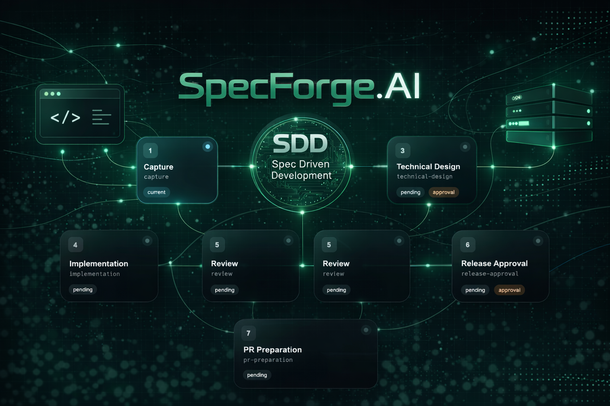

<p align="center">
  <a href="https://github.com/PinedaTec-EU/SpecForge.AI">
    
  </a>
</p>

# SpecForge.AI

SpecForge.AI is an early-stage developer tool for running structured SDD workflows inside VS Code.

The project focuses on governing how AI-assisted development happens, not only on generating code. It introduces explicit phases, persisted artifacts, human checkpoints, regressions, timeline tracking, and a minimal execution core that can evolve into a full MCP-backed workflow system.

## Status

This repository is currently a working foundation, not a finished product.

Implemented today:

- documented phase-1 workflow and persistence model
- .NET domain core for workflow rules and transitions
- local YAML persistence for `state.yaml` and `branch.yaml`
- local timeline and artifact generation via a workflow runner
- minimal VS Code extension scaffold
- user story explorer over `.specs/us/`
- minimal MCP server over `stdio`
- OpenAI-compatible phase provider infrastructure

Not implemented yet:

- full PR integration
- richer prompt inspection UX, diffing, and effective prompt visibility

## Features

- Canonical user story workflow:
  - `capture`
  - `refinement`
  - `technical_design`
  - `implementation`
  - `review`
  - `release_approval`
  - `pr_preparation`
- Phase execution semantics are explicit:
  - automatic/system-driven phases: `capture`, `technical_design`, `implementation`, `review`, `pr_preparation`
  - human checkpoint phases: `clarification`, `refinement`, and `release_approval`
- Explicit approval gates and regression rules
- Local workspace persistence under `.specs/us/us.<us-id>/`
- Human-readable artifacts in Markdown
- Shared audit trail in `timeline.md` with actor and UTC timestamp for user actions
- Explicit artifact operation logs such as `phases/01-spec.ops.md` when a developer asks the model to operate over the current spec
- Technical state in YAML
- Minimal workflow automation through a .NET runner
- Minimal VS Code extension for creating, importing, listing, and opening user stories

## Repository Layout

```text
.
├── doc/                       # Product, architecture, workflow, templates, roadmap
├── media/                     # VS Code extension assets
├── src-vscode/                # VS Code extension source
├── src/SpecForge.Domain/      # Workflow domain and application core
├── tests/SpecForge.Domain.Tests/
├── .specs/                    # Runtime user story persistence in the workspace
├── package.json               # VS Code extension manifest
└── SpecForge.AI.slnx          # .NET solution
```

## Architecture

The current design is intentionally split into layers:

- VS Code extension:
  - user-facing commands and explorer UI
  - workspace interaction
  - artifact opening and local user story discovery
- Domain and application core:
  - workflow rules
  - approval requirements
  - regression validation
  - local artifact and YAML persistence
  - minimal workflow runner
- MCP layer:
  - `stdio` MCP server with `initialize`, `tools/list`, and `tools/call`
  - orchestration boundary between extension and backend execution
  - base for future provider abstraction and richer backend execution
  - workflow file tools for listing, adding, and reclassifying `context files` versus `user story info`

See the detailed design documents in:

- [doc/product-vision.md](doc/product-vision.md)
- [doc/architecture.md](doc/architecture.md)
- [doc/business-rules-convention.md](doc/business-rules-convention.md)
- [doc/workflow-canonico-fase-1.md](doc/workflow-canonico-fase-1.md)
- [doc/spec-schema-fase-1.md](doc/spec-schema-fase-1.md)
- [doc/mcp-contract-fase-1.md](doc/mcp-contract-fase-1.md)
- [doc/implementation-plan.md](doc/implementation-plan.md)

## Installation

### Prerequisites

- .NET SDK 10
- Node.js 23+
- npm 10+
- VS Code 1.100+

### Clone

```bash
git clone <your-fork-or-repo-url>
cd SpecForge.AI
```

### Install Node dependencies

```bash
npm install
```

### Build the VS Code extension sources

```bash
npm run compile
```

The npm scripts invoke the local TypeScript compiler entrypoint directly, so the extension and test builds do not depend on a global `tsc`.

### Run .NET tests

```bash
dotnet test SpecForge.AI.slnx
```

### Run TypeScript tests

```bash
npm run test:ts
```

## Model Configuration

By default, phase execution uses a deterministic local engine.

To enable model-backed phase execution, configure at least one model profile.

Important: `provider` is not a global setting anymore. It lives inside each item in `specForge.execution.modelProfiles`, next to that profile's `baseUrl`, `apiKey`, and `model`. If you omit it, SpecForge.AI defaults it to `openai-compatible`.

Important too: `codex`, `copilot`, and `claude` are supported profile identities for routing and audit, but today they still run through the same OpenAI-compatible transport bridge. That means the developer can choose a provider family per phase now, while the repo stays honest about the fact that native provider adapters are still a later step.

Minimal shape of one profile:

```json
{
  "name": "light",
  "provider": "openai-compatible",
  "baseUrl": "http://localhost:11434/v1",
  "apiKey": "",
  "model": "llama3.1",
  "repositoryAccess": "none"
}
```

Equivalent shorthand without an explicit `provider` field:

```json
{
  "name": "light",
  "baseUrl": "http://localhost:11434/v1",
  "apiKey": "",
  "model": "llama3.1",
  "repositoryAccess": "none"
}
```

Full example with routing:

```json
{
  "specForge.execution.modelProfiles": [
    {
      "name": "planner",
      "provider": "copilot",
      "baseUrl": "https://api.example.test/v1",
      "apiKey": "<your-api-key>",
      "model": "gpt-4.1-mini",
      "repositoryAccess": "none"
    },
    {
      "name": "implementer",
      "provider": "codex",
      "baseUrl": "https://api.example.test/v1",
      "apiKey": "<your-api-key>",
      "model": "codex-5",
      "repositoryAccess": "read-write"
    },
    {
      "name": "reviewer",
      "provider": "claude",
      "baseUrl": "https://api.example.test/v1",
      "apiKey": "<your-api-key>",
      "model": "claude-sonnet",
      "repositoryAccess": "read"
    }
  ],
  "specForge.execution.phaseModels": {
    "defaultProfile": "planner",
    "implementationProfile": "implementer",
    "reviewProfile": "reviewer"
  }
}
```

With that setup, capture, clarification, refinement, technical design, release approval, and PR preparation use `defaultProfile`; implementation can be routed to the developer's preferred executor; review can use a separate provider family. `repositoryAccess` is part of the contract now:

- `none`: planning-only, no repo execution claims allowed
- `read`: enough for repository-aware review
- `read-write`: required before implementation can continue

If no model profiles are configured, SpecForge.AI stays on the deterministic local engine and the UI warns that model-backed execution is incomplete.

For local testing with Ollama, use a single profile that points at the local endpoint:

```json
{
  "specForge.execution.modelProfiles": [
    {
      "name": "local",
      "provider": "openai-compatible",
      "baseUrl": "http://localhost:11434/v1",
      "apiKey": "ollama-local",
      "model": "llama3.1",
      "repositoryAccess": "none"
    }
  ]
}
```

Example targeted routing for a developer who wants Codex for implementation and Claude for review:

```json
{
  "specForge.execution.modelProfiles": [
    {
      "name": "default-planner",
      "provider": "copilot",
      "baseUrl": "https://api.example.test/v1",
      "apiKey": "<your-api-key>",
      "model": "gpt-4.1-mini",
      "repositoryAccess": "none"
    },
    {
      "name": "codex-main",
      "provider": "codex",
      "baseUrl": "https://api.example.test/v1",
      "apiKey": "<your-api-key>",
      "model": "codex-5",
      "repositoryAccess": "read-write"
    },
    {
      "name": "claude-review",
      "provider": "claude",
      "baseUrl": "https://api.example.test/v1",
      "apiKey": "<your-api-key>",
      "model": "claude-sonnet",
      "repositoryAccess": "read"
    }
  ],
  "specForge.execution.phaseModels": {
    "defaultProfile": "default-planner",
    "implementationProfile": "codex-main",
    "reviewProfile": "claude-review"
  }
}
```

Tolerance can still be controlled through environment variables when launching the backend manually:

```bash
export SPECFORGE_CAPTURE_TOLERANCE=balanced
export SPECFORGE_REVIEW_TOLERANCE=balanced
```

The current supported `provider` values are `openai-compatible`, `codex`, `copilot`, and `claude`. Today all four share the same OpenAI-compatible chat-completions transport path, so the choice primarily controls routing, execution identity, audit metadata, and capability requirements rather than a fully native provider adapter.
For clarification, the backend supports three tolerance levels: `strict`, `balanced`, and `inferential`.
This value is sent as `SPECFORGE_CAPTURE_TOLERANCE`, adds explicit guidance to the clarification prompt, and maps clarification-only `temperature` as follows:

- `strict` -> `0.0`
- `balanced` -> `0.2`
- `inferential` -> `0.4`

For review, the backend supports the same three levels through `SPECFORGE_REVIEW_TOLERANCE`. It adds explicit review guidance to the prompt and maps review-only `temperature` using the same values:

- `strict` -> `0.0`
- `balanced` -> `0.2`
- `inferential` -> `0.4`

`temperature` is not exposed as an independent extension setting. The supported knobs are `clarificationTolerance` and `reviewTolerance`, and the backend derives `temperature` from them for the corresponding phases only.

Before executing real model-backed phases, initialize the repository prompt set through the MCP backend. This materializes `.specs/config.yaml` and `.specs/prompts/`, and the engine will fail fast if the required prompt files are missing.

## Usage

### Domain core

The .NET core already supports:

- creating a user story root
- persisting `state.yaml` and `branch.yaml`
- validating explicit user-story categories against the repo catalog in `.specs/config.yaml`
- advancing to the next valid phase
- approving approval-required phases
- creating the work branch metadata when the refinement/spec phase is approved using `<kind>/us-xxxx-short-slug`
- generating minimal phase artifacts and timeline entries
- initializing versioned repo prompts under `.specs/prompts/`
- requiring prompt initialization for real model-backed phase execution
- composing effective phase prompts from repo templates and runtime artifacts

### VS Code extension

The extension currently provides:

- a `SpecForge.AI` activity bar view
- a sidebar webview with embedded user-story intake
- an optional guided wizard in that intake to collect the minimum and recommended user-story information before creating the workflow
- a single high-contrast `Create User Story` empty state in the sidebar
- a compact header action in the sidebar to initialize or reinitialize `.specs/prompts/`
- per-user starred user stories persisted on disk inside the workspace
- automatic reopening of the starred user story in workflow view for the same local user
- a default navigation focus on active user stories and active workflows
- a workflow webview opened directly from a user story click
- per-phase detail inside the workflow view with artifact preview
- per-phase prompt access inside the workflow view when the selected phase exposes `execute` or `approve` templates
- user-story file management inside the workflow view, split between `context files` and `user story info`
- only `context files` are injected into model-backed runtime context; `user story info` remains attached to the workflow without entering the model prompt by default
- MCP tools to list, add, and reclassify workflow files so models can attach repo context without going through the VS Code UI
- clarification guidance inside the workflow view inviting the user to add more repo context when the model gets blocked
- local context-file suggestions during clarification using two default-enabled strategies: keyword heuristics and repo-neighborhood discovery
- a feature flag to disable clarification context suggestions without removing manual context-file intake
- persisted runtime status per user story so MCP clients can see whether a long-running phase generation is still active
- duplicate `generate_next_phase` requests are rejected while the same user story already has a live runtime operation
- inline audit stream sourced from `timeline.md`
- play / pause / stop controls for workflow execution
- unified workflow/sidebar state colors documented in `doc/workflow-visual-states.md`
- `Create User Story`
- `Import User Story`
- `Initialize Repo Prompts`
- `Open Prompt Templates`
- `Open Main Artifact`
- `Continue Phase`
- explicit `feature` / `bug` / `hotfix` selection when creating or importing a US
- explicit category selection from the repo category catalog when creating or importing a US
- user-story intake guidance that distinguishes minimum information from recommended extra detail
- extension settings for per-profile model routing, watcher behavior, and attention notifications
- visible configuration warnings with a direct link to extension settings when model profiles or phase assignments are incomplete
- auto-refresh watcher over `.specs/us/**` when enabled
- lightweight TypeScript tests for explorer grouping, detail rendering, MCP client payload/parsing, and extension command wiring

Current limitation:

- `stop` is best-effort: it cancels the local MCP backend process for the workspace, but it is not yet a durable job-control protocol
- the extension still does not provide a richer prompt editor, diffing, or effective prompt inspection UX
- the sidebar does not yet expose completed user stories through a visibility switch or search; for the MVP it stays focused on active work
- workflow execution controls such as `Play` and `Continue` remain disabled until the configured model profile catalog is complete

### User-story intake guidance

SpecForge.AI now helps both the user and any MCP-driven model understand what a usable user story should contain.

Minimum information:

- who or what is affected
- what change is requested
- how success will be validated

Recommended detail:

- expected scope or touched areas
- relevant repo context or likely files
- constraints, out-of-scope notes, or extra reviewer context

The sidebar intake keeps the original freeform source box, but also offers an optional guided wizard that turns those answers into structured source text before the user story is created.

### Spec baseline

The `refinement` phase is the functional checkpoint of the workflow. Its output is no longer treated as lightweight prose; it is the approved baseline spec for downstream work.

Current expectation for `01-spec.md`:

- inputs
- outputs
- business rules
- edge cases
- errors and failure modes
- constraints
- acceptance criteria
- explicit ambiguities and approval questions

This reduces approval fatigue versus forcing the user to approve both a weak refinement and a separate technical design by default. The technical design remains important, but phase 1 now treats it as a derived execution artifact rather than as a mandatory blocking checkpoint in every story.

The exact required schema for that artifact lives in [doc/spec-schema-fase-1.md](doc/spec-schema-fase-1.md). The approval path now validates that schema before the spec baseline can be frozen.

### Workflow readability

The workflow view intentionally distinguishes between:

- automatic phases that the system can execute when model configuration and prompts are ready
- user-driven checkpoints that require explicit approval before the next transition

Today the canonical checkpoints are `refinement` as the spec baseline and `release_approval` as the final human release gate. The graph and phase detail make this visible so the operator can see where the workflow will stop and wait for attention.

### Running the extension locally

1. Open the repository in VS Code.
2. Run `npm run compile`.
3. Start the extension from the VS Code Extension Development Host workflow.
4. Use the `SpecForge.AI` activity bar view.

### Extension settings

The extension contributes these settings:

- `specForge.execution.modelProfiles`
- `specForge.execution.phaseModels`
- `specForge.execution.clarificationTolerance`
- `specForge.execution.reviewTolerance`
- `specForge.ui.enableWatcher`
- `specForge.ui.notifyOnAttention`
- `specForge.features.enableContextSuggestions`

## Persistence Model

Each user story lives under:

```text
.specs/us/us.<us-id>/
```

Typical contents:

```text
.specs/us/us.US-0001/
  us.md
  clarification.md
  state.yaml
  branch.yaml
  timeline.md
  phases/
    01-spec.md
    02-technical-design.md
    03-implementation.md
    04-review.md
```

Per-user VS Code workspace preferences are stored separately:

```text
.specs/users/<local-user>/vscode-preferences.json
```

This preference file currently stores the starred user story that should reopen automatically for that same developer. It is ignored by git by default, so several developers can share the same workspace without overwriting each other's VS Code UX state.

`clarification.md` is persisted separately from `us.md`. The workflow UI keeps the accumulated clarification questions there, while `us.md` remains the stable source artifact instead of being rewritten with each clarification round.

## Roadmap

### Phase 1 foundation

- [x] define workflow, persistence, and templates
- [x] implement workflow domain rules
- [x] implement local YAML persistence
- [x] implement minimal workflow runner
- [x] create minimal VS Code extension scaffold

### Next

- [x] wire the VS Code extension to the local workflow runner
- [x] introduce a stable application/MCP boundary between UI and backend
- [x] replace placeholder artifact generation with real phase execution
- [x] refresh the explorer and open generated artifacts after workflow actions
- [x] add approval and user-story detail actions to the extension
- [x] add an OpenAI-compatible provider layer usable with OpenAI or Ollama
- [x] export versioned prompts per phase into `.specs/prompts/`
- [x] require repo prompt initialization before executing real model-backed phases
- [x] compose effective per-phase prompts from repo templates plus runtime context
- [x] expose explicit phase regression through domain, MCP, and VS Code
- [x] implement safe restart from source and archive superseded derived state
- [x] derive branch names from explicit US kind plus short slug
- [x] validate explicit US categories against a repo-configured catalog
- [x] group the VS Code explorer by user-story category
- [x] open user stories into a workflow view with phase detail and timeline audit
- [x] add extension settings for model profiles, phase routing, and watcher behavior
- [x] add watcher-driven refresh, attention notifications, and playback controls with best-effort stop
- [x] keep the default navigation focused on active user stories and workflows for the MVP
- [x] persist a per-user starred user story on disk and autoopen it when reopening the workspace
- [x] suggest clarification-time context files through local heuristics and repo neighborhood, behind a default-enabled feature flag
- [x] expose persisted runtime status so MCP clients can avoid duplicating long-running workflow executions
- [ ] finalize richer branch lifecycle rules and Git/PR metadata
- [x] add richer phase detail UI and graph visualization
- [ ] add issue and PR preparation integration
- [ ] support customizable workflows and agent profiles
- [ ] add a switch to show completed user stories and workflows
- [ ] add sidebar search across user stories and workflows

## MVP Roadmap

The current target is an MVP, not a feature-complete product.

### MVP scope

- [x] create and import user stories
- [x] persist workflow state and artifacts under `.specs/`
- [x] advance the canonical phase workflow with approvals
- [x] expose the workflow through a local MCP backend
- [x] support repo-initialized prompts and OpenAI-compatible model profiles
- [x] support explicit regression to an earlier valid phase
- [x] support safe restart from the original source
- [x] support per-user starred user stories with automatic reopening

### Post-MVP

- [x] graph visualization and richer workflow observability
- [ ] prompt diffing and effective prompt inspection UX
- [ ] GitHub PR / issue integration
- [ ] customizable workflows and agent profiles
- [ ] completed user story visibility toggle in the sidebar
- [ ] user story and workflow search in the sidebar

## Development

Useful commands:

```bash
npm install
npm run compile
dotnet test SpecForge.AI.slnx
```

The repository also contains local VS Code task files and tool manifests. Some of them may still reflect older local conventions and should not be treated as the primary source of truth over the documents in `doc/` and the current codebase.

## Contributing

This repository is still in early design and foundation stages. If you contribute:

- keep the workflow model explicit
- prefer persisted state over implicit conversational state
- avoid adding hidden environment-specific behavior
- update the design docs when you change workflow semantics

## License

[MIT](LICENSE)
