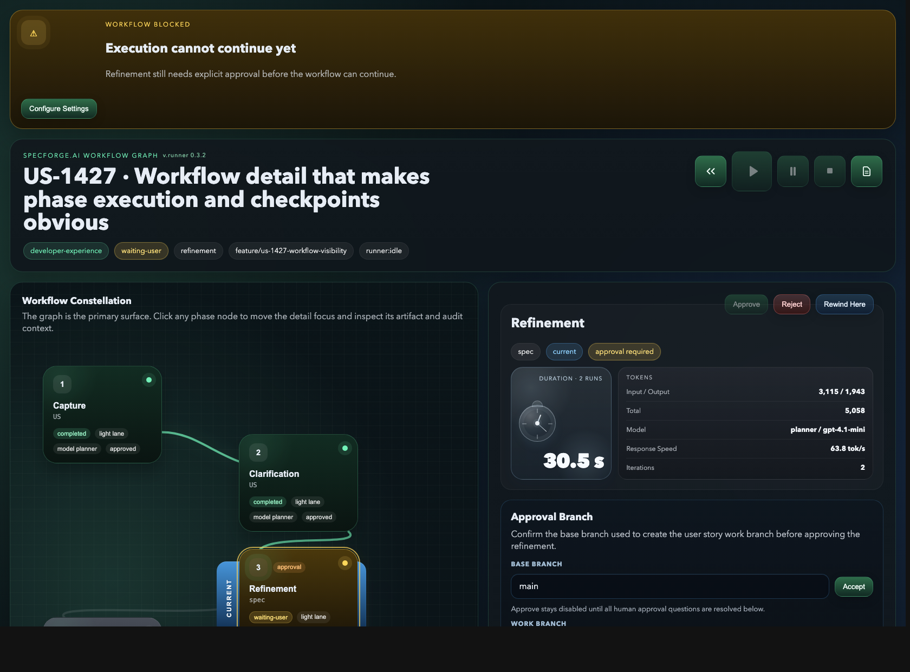
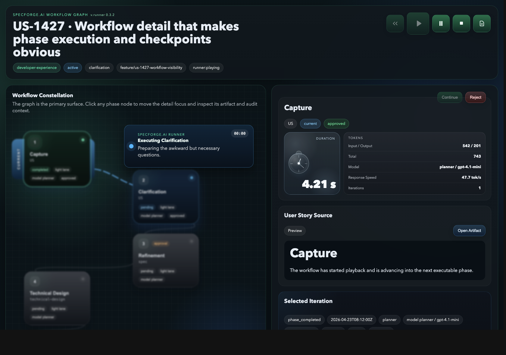

# Workflow Visual States

SpecForge.AI uses a single state-based color language across the sidebar and the workflow graph.

Phase identity is shown by text and ordering, not by color.

## Visual Reference

The current workflow UI already shows this state language clearly in practice.



The playback overlay keeps active execution in the same visual system instead of inventing a separate status surface.



## Canonical Palette

- Gray: not executed yet
- Blue: executing or paused
- Amber: waiting for user intervention
- Green: completed
- Red: blocked or error state

## Scope

These state colors apply to:

- workflow graph cards
- workflow graph borders and status dots
- sidebar phase rails
- sidebar active-card edge accents

## Notes

- `paused` is intentionally grouped with `active/running` under blue so execution and paused execution stay in the same family.
- Pending or disabled future phases stay gray until they are actually entered.
- Completed phases use green regardless of phase type.
- Errors and blocked states use red regardless of phase type.

## Regeneration

These screenshots are generated from the real workflow webview HTML with:

```bash
npm run docs:screenshots
```
